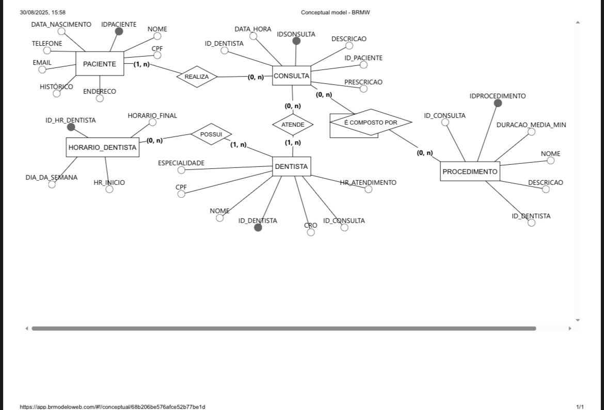
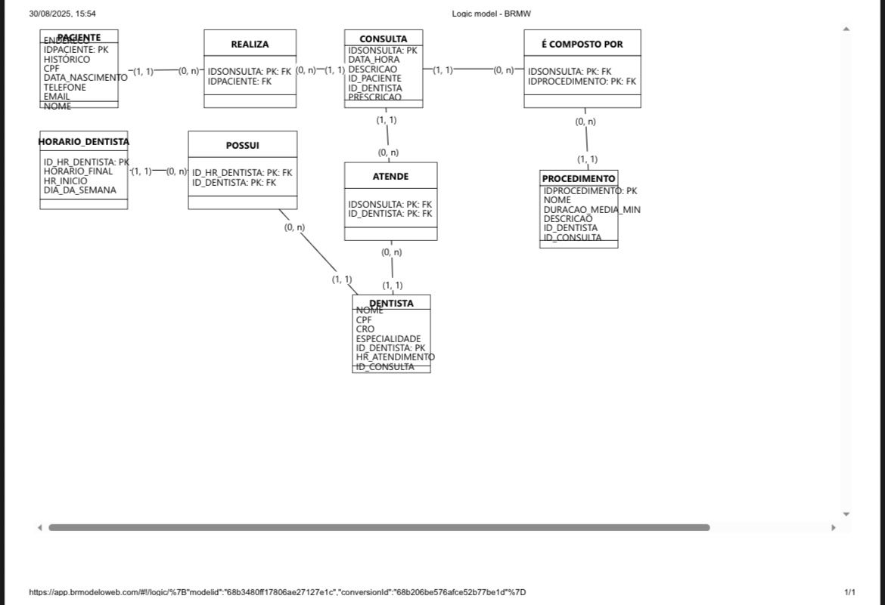

# Descrição

Este projeto descreve a modelagem e o desenvolvimento de um sistema de banco de dados para uma clínica odontológica. A finalidade é informatizar o processo de atendimento e a administração de pacientes, consultas e profissionais, possibilitando que a clínica mantenha um controle eficiente sobre os agendamentos, os procedimentos realizados e o histórico de atendimentos. O sistema foi elaborado para ser utilizado tanto pelos atendentes quanto pelos dentistas, tornando mais simples o acesso e a atualização das informações de maneira segura e organizada.

# Modelo Conceitual

# Modelo Lógico 

